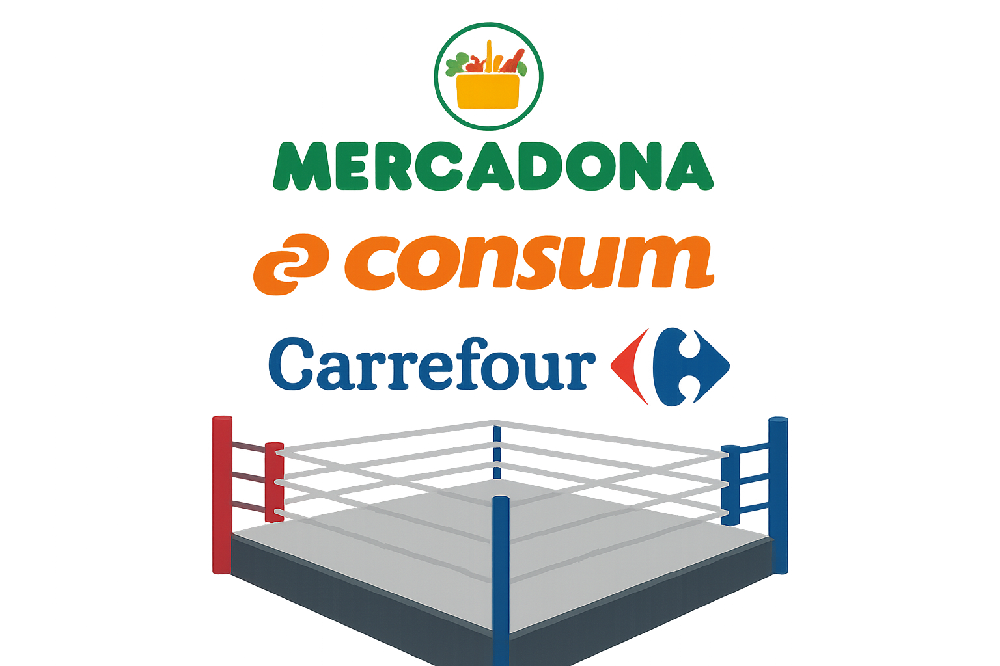

# 🛒 Análisis exploratorio de datos de los productos de los principales supermercados de Valencia

## 📘 Descripción del proyecto
Este proyecto realiza un **Análisis Exploratorio de Datos (EDA)** sobre tres de los principales supermercados en Valencia: **Mercadona**, **Consum** y **Carrefour**.  
El objetivo es analizar la posición de Mercadona en el sector mediante la **variedad de productos**, la **distribución de marcas** y los **precios** y relacionarlo con el **número de tiendas disponibles** de cada cadena.

A partir de datos obtenidos mediante **web scraping**, se estudian patrones de precios, formatos y categorías de productos, apoyándose en visualizaciones y mapas que ayudan a contrastar la hipótesis de que **Mercadona es el líder del mercado**.

---

## 🗂️ Organización del proyecto

La estructura del repositorio es la siguiente:

```
📁 matriz/
│
├── 📁 data/
│   ├── data_raw/        # Datos originales obtenidos del web scraping
│   ├── data_clean/      # Datos procesados y listos para el análisis
│
├── 📁 img/
│   ├── *.png / *.jpg    # Imágenes generadas durante el EDA y mapas de los supermercados
│   
│
├── 📁 presentación/
│   └── resultados_EDA_supermercados.pdf  # Presentación resumen del análisis
│
├── 📁 src/
│   ├── utils.py         # Funciones de apoyo para limpieza y análisis
│   ├── scraping_mercadona.py
│   ├── scraping_consum.py
│   ├── scraping_carrefour.py
│   ├── pruebas.ipynb    # Notebooks exploratorios
│
└── 📄 EDA_supermercados.ipynb   # Notebook principal del proyecto
```

---

## 📊 Descripción de los datasets

Cada dataset contiene la información de productos extraída de las páginas web de cada supermercado.  
Las columnas incluidas son:

| Columna | Descripción |
|----------|-------------|
| `nombre` | Nombre completo del producto |
| `formato` | Peso, volumen o unidades del envase |
| `precio` | Precio del producto en euros |
| `precio_ud/Kg/L` | Precio por kilo o litro o ud (cuando aplica) |
| `marca` | Marca comercial o marca blanca |
| `categoría` | Categoría o familia del producto (lácteos, frescos, bebidas, etc.) |

---

## 🧰 Requisitos

Para ejecutar el notebook correctamente se recomienda tener instalado **Python 3.9.11** y las siguientes librerías:

```bash
pip install pandas numpy matplotlib seaborn plotly geopandas folium requests beautifulsoup4
```

También se recomienda tener Jupyter Notebook o JupyterLab instalado para ejecutar los análisis interactivos.

---

## 📓 Estructura del Notebook

El notebook principal (`EDA_supermercados.ipynb`) se organiza en dos fases principales:

1. [Fase 1: Lectura y limpieza](#fase-1-lectura-y-limpieza)  
   1. [Funciones de apoyo](#funciones-de-apoyo)  
   + [Mercadona](#depuración-y-limpieza-del-dataset-de-mercadona)  
   + [Consum](#depuración-y-limpieza-del-dataset-de-consum)  
   + [Carrefour](#depuración-y-limpieza-del-dataset-de-carrefour)  
2. [Fase 2: Análisis y visualización](#fase-2-análisis-y-visualización)

**Fase 1: Lectura y limpieza**  
En esta etapa se cargan los datasets, se eliminan duplicados y valores nulos, se normalizan formatos y precios, y se homogenizan las categorías entre supermercados.

**Fase 2: Análisis y visualización**  
Se exploran las diferencias en número de productos, presencia de marcas propias, variedad por categoría, cantidad de tiendas y se realiza una cesta genérica
para comparar precios entre supermercados.
Las conclusiones se apoyan en gráficos, mapas y comparativas visuales.

---

## 🧩 Resultados esperados

- Comprensión general de la **oferta de productos** en cada supermercado.  
- Visualización de la **presencia territorial** y relación con la variedad de productos.  
- Apoyo visual en una **presentación en PDF** incluida en la carpeta `presentación`.

---

## 🪄 Licencia
Este proyecto se distribuye bajo licencia **MIT**, lo que permite su uso y modificación con fines educativos o de investigación.

---
